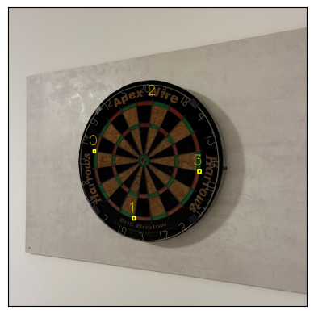
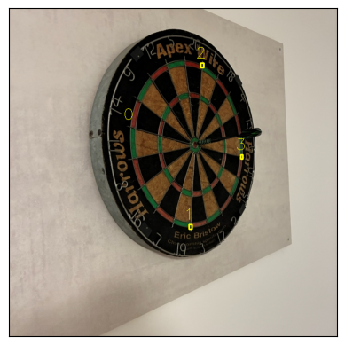
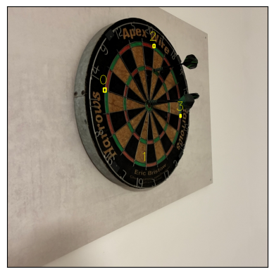
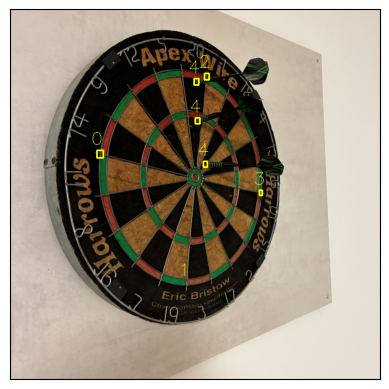
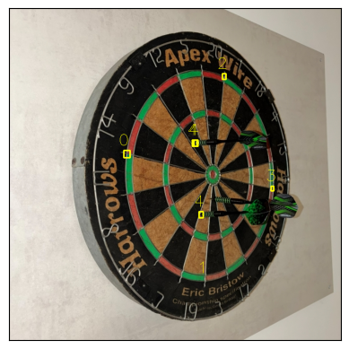

# Documentation

## YOLOv3

On some of the training images it found something but on real world images nothing.

## YOLOv8n Predictions on real world images

The "markers" on the board are easily found even on real world images, but usually not all of the darts.

